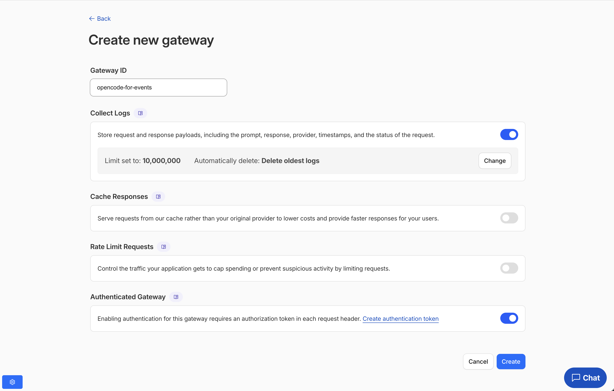
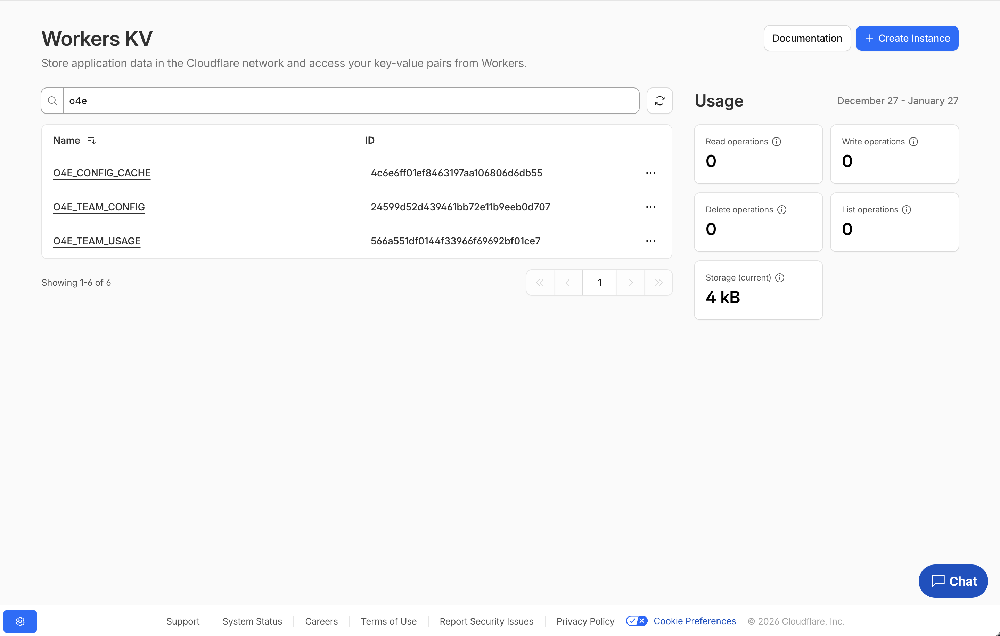
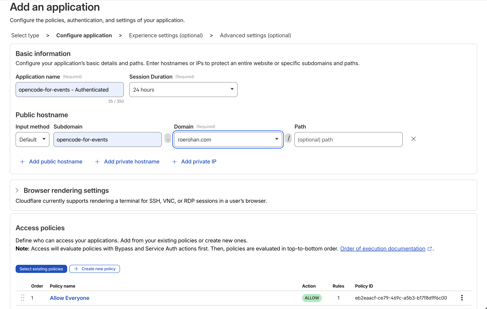
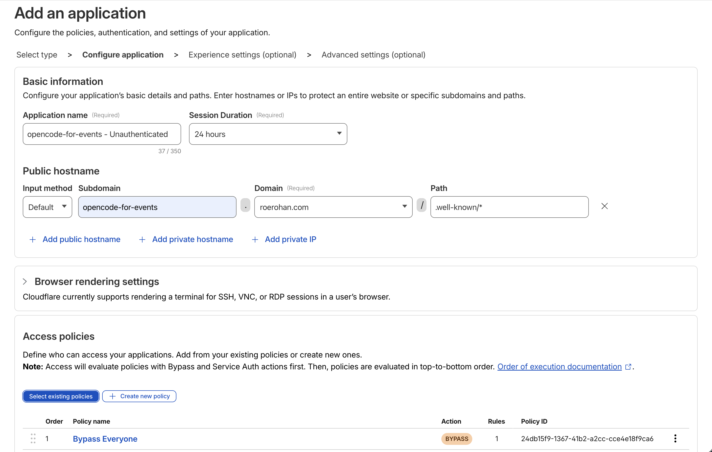

# OpenCode for Events

Distribute [OpenCode](https://opencode.ai) access to event participants with team-based credit limits and automatic usage tracking.

[](https://deploy.workers.cloudflare.com/?url=https://github.com/roerohan/opencode-for-events)

## Overview

This Cloudflare Worker provides authenticated OpenCode access for hackathons and events where:
- Participants are organized into teams
- Each team has a fixed credit allocation (e.g., $20)
- Usage is tracked automatically in real-time
- Access is blocked when team credits are exhausted

**Perfect for:** Hackathons, workshops, conferences, and any event where you want to provide AI coding assistance with budget control.

## Architecture

```
User Request → JWT Validation → Team Lookup → Credit Check → AI Gateway → Usage Tracking
```

## Prerequisites

Before deploying, you'll need:

1. A Cloudflare account ([sign up free](https://dash.cloudflare.com/sign-up))
2. [Wrangler CLI](https://developers.cloudflare.com/workers/wrangler/install-and-update/) installed
3. [Node.js](https://nodejs.org/) 18+ and npm
4. A custom domain or Workers subdomain for your deployment

## Quick Setup

### 1. Clone and Install

```bash
git clone https://github.com/roerohan/opencode-for-events.git
cd opencode-for-events
npm install
```

### 2. Create AI Gateway

1. Go to [Cloudflare Dashboard](https://dash.cloudflare.com) → AI → AI Gateway
2. Click **Create Gateway**
3. Name it **exactly** `opencode-for-events` (or update the `GATEWAY_ID` in wrangler.jsonc)
4. Set **Authenticated Gateway** as needed (optional but recommended)
5. Click **Create**
6. Note down your **Cloudflare Account ID** and **AI Gateway ID/Name** from the dashboard



### 3. Create KV Namespaces

Create three KV namespaces for storing team configuration, usage data, and cache:

```bash
# Create team configuration storage
wrangler kv namespace create "O4E_TEAM_CONFIG"

# Create usage tracking storage
wrangler kv namespace create "O4E_TEAM_USAGE"

# Create config cache storage
wrangler kv namespace create "O4E_CONFIG_CACHE"
```

Each command will output a namespace ID. Save these for the next step.



### 4. Configure wrangler.jsonc

Open `wrangler.jsonc` and update the following:

#### KV Namespace IDs

Replace the placeholder IDs with your newly created namespace IDs:

```jsonc
"kv_namespaces": [
  {
    "binding": "O4E_TEAM_CONFIG",
    "id": "YOUR_TEAM_CONFIG_NAMESPACE_ID"  // From step 3
  },
  {
    "binding": "O4E_TEAM_USAGE",
    "id": "YOUR_TEAM_USAGE_NAMESPACE_ID"   // From step 3
  },
  {
    "binding": "O4E_CONFIG_CACHE",
    "id": "YOUR_CONFIG_CACHE_NAMESPACE_ID" // From step 3
  }
]
```

> On newer wrangler versions, this will be done automatically. You might need to remove duplicate entries.

#### Gateway Configuration

Update the `vars` section with your Cloudflare Account ID and Gateway details:

```jsonc
"vars": {
  "GATEWAY_ACCOUNT_ID": "<YOUR_CLOUDFLARE_ACCOUNT_ID>",  // From step 2
  "GATEWAY_ID": "opencode-for-events",
  "GATEWAY_URL": "https://gateway.ai.cloudflare.com/v1/<YOUR_CLOUDFLARE_ACCOUNT_ID>/opencode-for-events",
  "CF_ACCESS_TEAM_NAME": "<YOUR_CLOUDFLARE_ACCESS_TEAM_NAME>"  // From Zero Trust dashboard
}
```

To find your Cloudflare Access team name:
1. Go to your [Cloudflare Zero Trust dashboard](https://one.dash.cloudflare.com/?to=/:account/settings)
2. Navigate to **Settings** → **Custom Pages**
3. Your team name is shown in the URL format: `https://<TEAM_NAME>.cloudflareaccess.com`
4. Use this team name (e.g., `cfcommunity`, `mycompany`, etc.) for the `CF_ACCESS_TEAM_NAME` variable

#### Custom Domain (Optional)

If using a custom domain, update the routes section:

```jsonc
"routes": [
  {
    "pattern": "your-domain.com",  // Replace with your domain
    "custom_domain": true
  }
]
```

Otherwise, remove the `routes` section and use the default `*.workers.dev` domain.

Note, you will also need to add the custom domain to [public/index.html](./public/index.html).

### 5. Set API Gateway Secret

Create an API token for your AI Gateway (with Run permissions) and store your AI Gateway API key as a secret:

```bash
wrangler secret put GATEWAY_API_KEY
```

When prompted, paste your AI Gateway API key. You can find this in the Cloudflare Dashboard, or visit `https://dash.cloudflare.com/<YOUR_CLOUDFLARE_ACCOUNT_ID>/ai/ai-gateway/gateways/opencode-for-events/settings/tokens`.

### 6. Create Cloudflare Access Applications

You need to create **two** Cloudflare Access applications to secure your worker:

#### Application 1: Main Worker Access (with JWT signing)

1. Go to **Zero Trust** → **Access** → **Applications** → **Add an application**
2. Choose **Self-hosted**
3. Configure the application:
   - **Application name**: `opencode-for-events - Authenticated`
   - **Session Duration**: Choose based on your event length
   - **Application domain**: Your worker domain (e.g., `opencode-for-events.roerohan.com`)
4. Go to **Policies** tab and add:
   - **Policy name**: `Allow Everyone`
   - **Action**: ALLOW
   - **Include**: Everyone
5. **Save application**



#### Application 2: Public Endpoint (bypass for /.well-known/opencode)

1. Go to **Zero Trust** → **Access** → **Applications** → **Add an application**
2. Choose **Self-hosted**
3. Configure the application:
   - **Application name**: `opencode-for-events - Unauthenticated`
   - **Application domain**: Your worker domain with path `/.well-known/*` (e.g., `opencode-for-events.roerohan.com/.well-known/*`)
4. Go to **Policies** tab and add:
   - **Policy name**: `Bypass - Everyone`
   - **Action**: BYPASS
   - **Include**: Everyone
5. **Save application**



**Important**: Make sure the public endpoint application (with BYPASS) is ordered **before** the main application in the Access policies list. Access evaluates policies in top-to-bottom order.

### 7. Configure Teams

Create a `teams.json` file with your team configuration:

```json
[
  {
    "teamId": "team-alpha",
    "emails": [
      "alice@example.com",
      "bob@example.com"
    ],
    "creditLimit": 75.00
  },
  {
    "teamId": "team-beta",
    "emails": [
      "charlie@example.com",
      "dana@example.com"
    ],
    "creditLimit": 50.00
  }
]
```

- `teamId`: **Unique** identifier for each team
- `emails`: List of participant email addresses (must match their login emails)
- `creditLimit`: Maximum spending in USD

Upload teams to KV:

```bash
npm run setup-teams -- teams.json
```

### 8. Deploy

```bash
npm run deploy
```

Your worker will be live at your custom domain/workers.dev subdomain.

## Usage

### For Participants

1. Install [OpenCode CLI](https://opencode.ai/docs/installation) and [cloudflared](https://github.com/cloudflare/cloudflared?tab=readme-ov-file#installing-cloudflared)
2. Run: `opencode auth login https://<your-worker-domain>.com`
3. Use `cloudflared` to authenticate via Cloudflare Access (opens browser)
4. Start coding with OpenCode!

### For Organizers

#### View Team Usage

```bash
# View specific team
wrangler kv key get "team-alpha" --binding O4E_TEAM_USAGE

# List all teams
wrangler kv key list --binding O4E_TEAM_USAGE

# Use the helper script
npm run view-teams
```

Example output:
```json
{
  "teamId": "team-alpha",
  "totalCost": 5.23,
  "lastUpdated": "2026-01-19T10:30:00.000Z",
  "requestCount": 42
}
```

#### Reset Team Usage

```bash
# Reset a specific team (e.g., for testing or new event phase)
wrangler kv key delete "team-alpha" --binding O4E_TEAM_USAGE
```

#### Update Credit Limits

Edit your `teams.json` and re-run:

```bash
npm run setup-teams -- teams.json
```

## Configuration

### Environment Variables

Set in `wrangler.jsonc` under `vars`:
- `GATEWAY_ACCOUNT_ID` - Your Cloudflare account ID
- `GATEWAY_ID` - AI Gateway identifier (must be `opencode-for-events`)
- `GATEWAY_URL` - Full AI Gateway URL
- `CF_ACCESS_TEAM_NAME` - Your Cloudflare Access team name (find at https://one.dash.cloudflare.com/?to=/:account/settings)

Set as secrets (via `wrangler secret put`):
- `GATEWAY_API_KEY` - AI Gateway API token

### Credit Limit Guidelines

Recommended starting values based on event type:
- **24-hour Hackathon**: $50-100 per team
- **4-hour Workshop**: $15-30 per team  
- **3-day Conference**: $150-300 per team

Adjust based on:
- Event duration
- Team size
- Expected usage patterns
- Total budget

## API Behavior

### Successful Request Flow

1. User authenticates via Cloudflare Access (JWT token issued)
2. Worker extracts email from JWT
3. Email mapped to team via `O4E_TEAM_CONFIG` KV
4. Current usage checked from `O4E_TEAM_USAGE` KV
5. If usage < credit limit:
   - Request proxied to AI Gateway
   - Response streamed back to user
   - Usage cost tracked and added to team total

### Error Responses

#### 401 Unauthorized
Missing or invalid authentication token.

#### 403 Forbidden
```json
{
  "error": "Forbidden",
  "message": "Email user@example.com is not assigned to any team",
  "status": 403,
  "timestamp": "2026-01-19T10:30:00.000Z"
}
```

#### 429 Quota Exceeded
```json
{
  "error": "Quota Exceeded",
  "message": "Team team-alpha has exceeded credit limit ($75). Current usage: $75.45",
  "status": 429,
  "timestamp": "2026-01-19T10:30:00.000Z"
}
```

## Development

```bash
# Install dependencies
npm install

# Generate TypeScript types
npm run cf-typegen

# Build OpenCode configuration
npm run build:config

# Run locally
npm run dev

# Deploy to production
npm run deploy
```

### Project Structure

```
config/
  base.json               # Core OpenCode provider config
  opencode.json           # Generated config (gitignored)
public/
  index.html              # Landing page
scripts/
  build-config.ts         # Config builder
  setup-teams.ts          # Team setup utility
  view-teams.ts           # Usage viewer
src/
  index.ts                # Main worker entry point
wrangler.jsonc            # Worker configuration
teams.example.json        # Example team config
```

## Monitoring

### Real-time Dashboard

Monitor your deployment in the Cloudflare Dashboard:
- **Workers & Pages** → Your worker → **Metrics**
- **AI** → **AI Gateway** → **opencode-for-events** → **Analytics**

### Team Status Script

Create `monitor-teams.sh` for quick team status checks:

```bash
#!/bin/bash
for team in $(wrangler kv key list --binding O4E_TEAM_CONFIG | jq -r '.[].name'); do
  echo "Team: $team"
  
  config=$(wrangler kv key get "$team" --binding O4E_TEAM_CONFIG)
  limit=$(echo $config | jq -r '.creditLimit')
  
  usage=$(wrangler kv key get "$team" --binding O4E_TEAM_USAGE 2>/dev/null || echo '{"totalCost":0}')
  cost=$(echo $usage | jq -r '.totalCost')
  
  echo "  Limit: \$$limit"
  echo "  Used: \$$cost"
  echo "  Remaining: \$$(echo "$limit - $cost" | bc)"
  echo
done
```

Make it executable: `chmod +x monitor-teams.sh`

## Troubleshooting

### "Email not assigned to any team" error
- Verify email in `teams.json` matches the authentication email exactly
- Re-run `npm run setup-teams -- teams.json` after changes
- Check that emails are lowercase in the config

### Authentication fails
- Verify both Cloudflare Access applications are configured correctly
- Ensure the public endpoint (/.well-known/*) has BYPASS policy
- Check that the main application domain matches your worker domain

### Gateway errors
- Verify `GATEWAY_API_KEY` secret is set: `wrangler secret list`
- Check gateway name is exactly `opencode-for-events`
- Confirm `GATEWAY_ACCOUNT_ID` matches your account

### KV namespace not found
- Verify namespace IDs in `wrangler.jsonc` match created namespaces
- List namespaces: `wrangler kv namespace list`

## Contributing

Contributions welcome! Please open an issue or submit a pull request.

## License

MIT License - see [LICENSE](LICENSE) for details.

## Support

- **Issues**: [GitHub Issues](https://github.com/roerohan/opencode-for-events/issues)
- **OpenCode Docs**: [opencode.ai/docs](https://opencode.ai/docs)
- **Cloudflare Workers**: [developers.cloudflare.com/workers](https://developers.cloudflare.com/workers)

---

Made with ❤️ for the developer community. Perfect for hackathons, workshops, and coding events.
